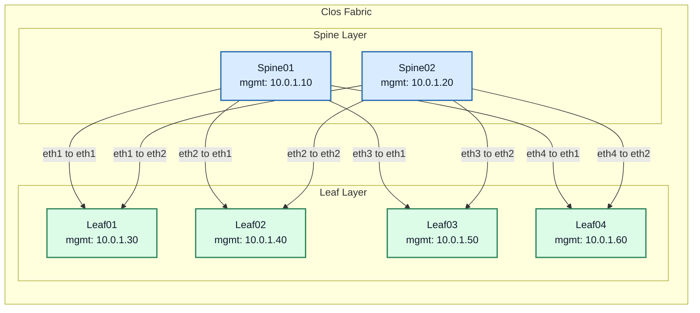

# Arista cEOS VXLAN/EVPN Topology

Generated from [topology.clab.yml](/Users/coreygeorge/Downloads/VXLAN-EVPN-1/topology.clab.yml).

```mermaid
flowchart TB
  classDef spine fill:#d9ecff,stroke:#2b6cb0,stroke-width:2px,color:#0f172a;
  classDef leaf fill:#dcfce7,stroke:#2f855a,stroke-width:2px,color:#0f172a;

  subgraph FABRIC["Clos Fabric"]
    direction TB

    subgraph SPINES["Spine Layer"]
      direction LR
      Spine01["Spine01<br/>mgmt: 10.0.1.10"]
      Spine02["Spine02<br/>mgmt: 10.0.1.20"]
    end

    subgraph LEAVES["Leaf Layer"]
      direction LR
      Leaf01["Leaf01<br/>mgmt: 10.0.1.30"]
      Leaf02["Leaf02<br/>mgmt: 10.0.1.40"]
      Leaf03["Leaf03<br/>mgmt: 10.0.1.50"]
      Leaf04["Leaf04<br/>mgmt: 10.0.1.60"]
    end

    Spine01 -->|eth1 to eth1| Leaf01
    Spine01 -->|eth2 to eth1| Leaf02
    Spine01 -->|eth3 to eth1| Leaf03
    Spine01 -->|eth4 to eth1| Leaf04

    Spine02 -->|eth1 to eth2| Leaf01
    Spine02 -->|eth2 to eth2| Leaf02
    Spine02 -->|eth3 to eth2| Leaf03
    Spine02 -->|eth4 to eth2| Leaf04
  end

  class Spine01,Spine02 spine;
  class Leaf01,Leaf02,Leaf03,Leaf04 leaf;
```
